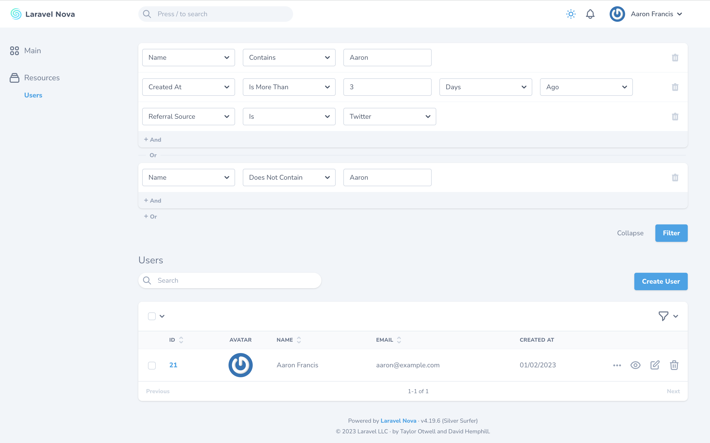

# Refine for Laravel Nova

[Refine](https://hammerstone.dev) is a powerful, visual query builder for Laravel Nova 3 and 4. Refine is a paid
package, which you can purchase at [hammerstone.dev](https://hammerstone.dev).

> We also have libraries for Laravel (without Nova) and Ruby on Rails at [hammerstone.dev](https://hammerstone.dev).

Refine lets you define filterable conditions per resource, and then your users can mix and match them in any way they
want to find exactly what they're looking for.

```php
// Create a filter called "UserFilter"
class UserFilter extends Filter
{
    public function conditions()
    {
        return [
            // Number condition on the ID column
            NumericCondition::make('id', 'ID'),
            
            // Text condition on the name column
            TextCondition::make('name', 'Name'),
            
            // Boolean condition on the is_subscriber column
            BooleanCondition::make('is_subscriber', 'Subscriber'),
            
            // Option condition on the referral column
            OptionCondition::make('referral', 'Referral Source')
                ->options([
                    'twitter' => 'Twitter',
                    'linkedin' => 'LinkedIn',
                    'fb' => 'Facebook'
                ]),
                
            // Date condition on the created_at column
            DateWithTimeCondition::make('created_at', 'Created At'),
        ];
    }
}
```


Refine for Laravel Nova 4

## Installation

To use Refine with Nova, you must first require the package `composer require hammerstone/refine-nova`. This will
install `hammerstone/refine-laravel` as well. Since `refine-laravel` is a paid package, you will need to make sure your
credentials are available to composer in the `auth.json` file.

## Integration

Create a `UserFilter` class in your `app\Filters` directory.

```php
namespace App\Filters;

use Hammerstone\Refine\Conditions\NumericCondition;
use Hammerstone\Refine\Filter;

class UserFilter extends Filter
{
    public function conditions()
    {
        return [
            NumericCondition::make('id', 'ID'),
            
            // @TODO: Add more conditions
        ];
    }
}
```

In your `app\Nova\User` file, you'll need to add the `RefinesModels` trait and reference your newly created filter.

```php
use App\Filters\UserFilter;
use Hammerstone\Refine\Nova\RefinesModels;

class User extends Resource
{
    use RefinesModels;
    
    // ...
    
    public static $filter = UserFilter::class;
}
```

Finally, to show the query builder on the frontend, you'll need to add the Refine card:

```php
public function cards(Request $request)
{
    return [
        static::refineCard()
    ];
}
```

That's it! You should see the Refine query builder on the Users page in Nova. You can read further documentation about
building filters in the [Refine documentation](https://hammerstone.dev/refine/laravel/docs/main). 